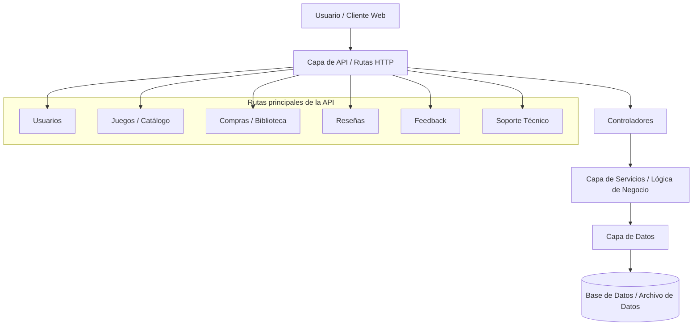
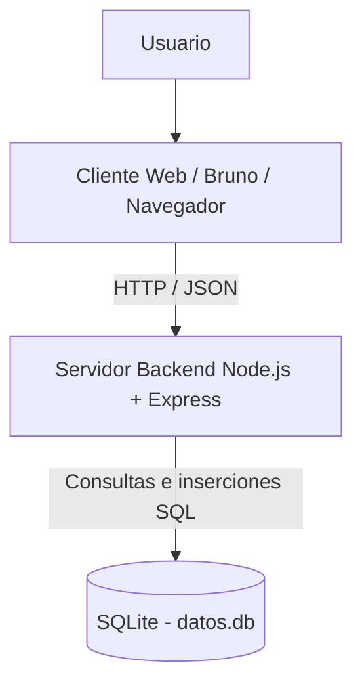

## 1. Estilo Arquitectónico 

Estilo adoptado: Arquitectura en Capas (Layered Architecture)

Justificación basada en REF priorizados: 

| ID     | Tipo                         | Descripción                                                                         | Prioridad | Cómo lo aborda el estilo                                                                           | 
|--------|------------------------------|-------------------------------------------------------------------------------------|-----------|----------------------------------------------------------------------------------------------------|
| REF-01 | Eficiencia                   | El sistema debe responder a las solicitudes en menos de 2 segundos.                 | Alta      | La separación por capas logra una mejor organización y permite respuestas más rapidas.             |
| REF-02 | Seguridad                    | Autenticación para acciones de usuario.                                             | Alta      | La arquitectura permite ubicar las validaciones en una capa antes de acceder a los datos.          |
| REF-05 | Mantenibilidad               | El codigo debe estar ordenado para facilitar su mantencion.                         | Alta      | Permite modificar una parte del sistema sin afectar directamente a las demás.                      |
| REF-07 | Integridad de datos          | El sistema debe evitar datos duplicados.                                            | Alta      | centraliza las reglas y validaciones en una capa antes de guardar información en la capa de datos. |
| REF-08 | Testabilidad                 | Las funcionalidades implementadas deben contar con casos de prueba.                 | Alta      | Es más fácil diseñar y ejecutar pruebas específicas.                                               |

**Explicación textual**:
Se escogió una arquitectura en capas porque el sistema corresponde a una plataforma de videojuegos que debe gestionar usuarios, catálogo de juegos, biblioteca personal, compras o adquisiciones, reseñas, feedback y soporte técnico.

Este estilo permite dividir el sistema en partes claras: una capa de presentación o cliente que interactúa con el usuario, una capa de API que recibe las solicitudes HTTP, una capa de lógica de negocio que valida las reglas del sistema, y una capa de datos que almacena la información principal.

La arquitectura en capas es adecuada para este proyecto porque facilita la mantención, la incorporación de nuevas funcionalidades y la realización de pruebas. Por ejemplo, si se necesita modificar la forma en que se valida una compra, solo se cambia la lógica de negocio correspondiente, sin afectar directamente la estructura de datos ni las rutas de la API.

## 2. Diagrama de Arquitectura 

## 3. Descomposición Modular 
La plataforma se organiza en módulos funcionales que representan las principales capacidades del sistema y mantienen coherencia con las rutas principales de la API definidas en el diagrama de arquitectura. Cada módulo se implementa siguiendo la arquitectura en capas: rutas HTTP, controladores, servicios o lógica de negocio y capa de datos.

Esta descomposición permite relacionar las funcionalidades del sistema con los requisitos extrafuncionales priorizados, especialmente la organización del backend, la validación de identidad, el control de duplicados, el rendimiento esperado y la facilidad para realizar pruebas.

|   Modulos  |                                                                  |
|------------|------------------------------------------------------------------|
| Módulo de Usuarios | El módulo de Usuarios gestiona el registro, inicio de sesión e identificación de los usuarios dentro de la plataforma. Este módulo permite que un visitante cree una cuenta y que un usuario registrado pueda iniciar sesión para acceder a funcionalidades restringidas del sistema.|
| Módulo de Juegos / Catálogo | El módulo de Juegos / Catálogo permite consultar los videojuegos disponibles en la plataforma y visualizar su información principal. Este módulo representa una parte central del sistema, ya que permite a visitantes y usuarios registrados conocer los títulos ofrecidos antes de adquirirlos. |
| Módulo de Compras / Biblioteca | El módulo de Compras / Biblioteca gestiona la adquisición de videojuegos y la consulta de los juegos asociados a cada usuario registrado. Este módulo conecta el catálogo con la experiencia personal del usuario, ya que permite que los videojuegos adquiridos se agreguen a una biblioteca personal.|
| Módulo de Reseñas | El módulo de Reseñas permite que los usuarios registrados publiquen comentarios y calificaciones sobre videojuegos. Este módulo fortalece la participación de la comunidad, ya que permite compartir opiniones públicas sobre los títulos disponibles en la plataforma.|
| Módulo de Feedback | El módulo de Feedback permite que los usuarios registrados envíen sugerencias o comentarios orientados a mejorar los videojuegos disponibles, el catálogo o la experiencia general de la plataforma. A diferencia de las reseñas, el feedback no se enfoca necesariamente en una opinión pública, sino en recopilar información útil para la evolución del sistema y del catálogo. |
| Módulo de Soporte Técnico | El módulo de Soporte Técnico permite que los usuarios registrados creen y consulten solicitudes de soporte relacionadas con su cuenta, biblioteca, compras o funcionamiento general de la plataforma. Este módulo responde a la necesidad de brindar atención a problemas reportados por los usuarios y mantener una experiencia de uso más confiable. |

## 4. Diagrama de Despliegue
El sistema se despliega de forma local con una separación simple entre cliente, servidor backend y base de datos. El usuario interactúa desde un navegador o una herramienta de pruebas como Bruno, las solicitudes son recibidas por un servidor backend desarrollado con Node.js y Express, y la información se almacena en una base de datos SQLite en el archivo `datos.db`.

El despliegue propuesto es coherente con la implementación actual del proyecto, ya que el backend está desarrollado con Node.js y Express, expone endpoints HTTP como /juegos y /resenas, y utiliza SQLite mediante better-sqlite3 para persistir datos en el archivo local datos.db. Esta estructura permite una solución simple y funcional para el alcance del proyecto, facilitando instalación, ejecución local y pruebas de la API.

