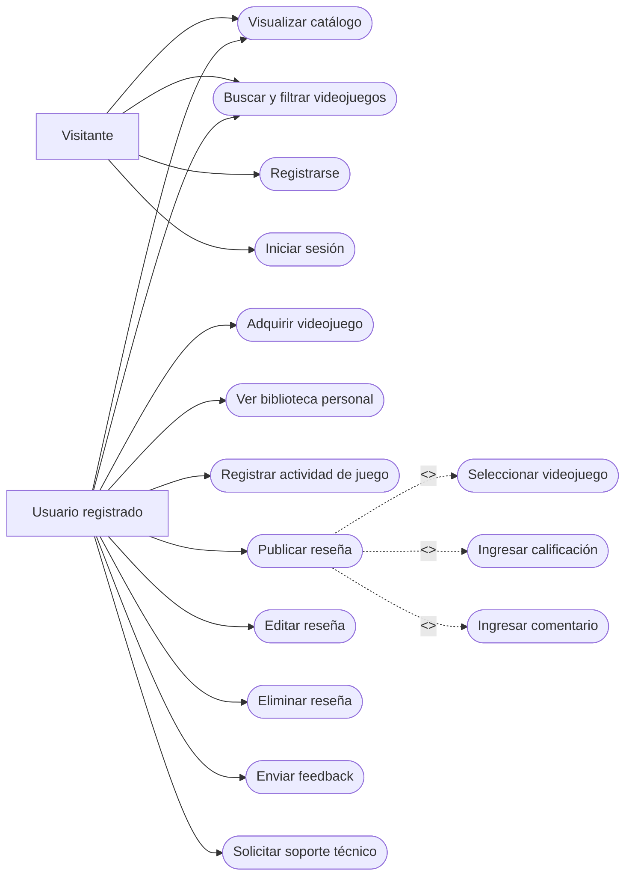

```mermaid
flowchart LR
    V[Visitante]
    U[Usuario registrado]

    CU1([Visualizar catálogo])
    CU2([Buscar y filtrar videojuegos])
    CU3([Registrarse])
    CU4([Iniciar sesión])
    CU5([Adquirir videojuego])
    CU6([Ver biblioteca personal])
    CU7([Registrar actividad de juego])
    CU8([Publicar reseña])
    CU9([Editar reseña])
    CU10([Eliminar reseña])
    CU11([Enviar feedback])
    CU12([Solicitar soporte técnico])
    CU13([Seleccionar videojuego])
    CU14([Ingresar calificación])
    CU15([Ingresar comentario])

    V --> CU1
    V --> CU2
    V --> CU3
    V --> CU4

    U --> CU1
    U --> CU2
    U --> CU5
    U --> CU6
    U --> CU7
    U --> CU8
    U --> CU9
    U --> CU10
    U --> CU11
    U --> CU12

    CU8 -. "<<include>>" .-> CU13
    CU8 -. "<<include>>" .-> CU14
    CU8 -. "<<include>>" .-> CU15
```

