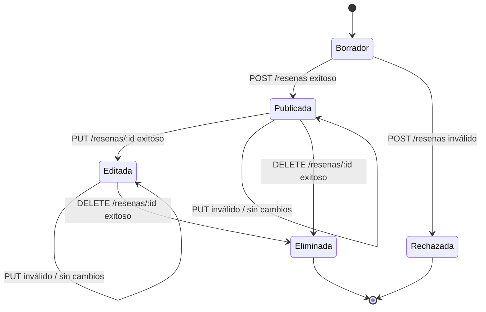

# Diagrama de Estados - Reseña

```mermaid id="j270cl"
stateDiagram-v2
    [*] --> Borrador

    Borrador --> Publicada: POST /resenas exitoso
    Borrador --> Rechazada: POST /resenas inválido

    Publicada --> Editada: PUT /resenas/:id exitoso
    Publicada --> Publicada: PUT inválido / sin cambios

    Editada --> Editada: PUT /resenas/:id exitoso
    Editada --> Editada: PUT inválido / sin cambios

    Publicada --> Eliminada: DELETE /resenas/:id exitoso
    Editada --> Eliminada: DELETE /resenas/:id exitoso

    Rechazada --> [*]
    Eliminada --> [*]
```

