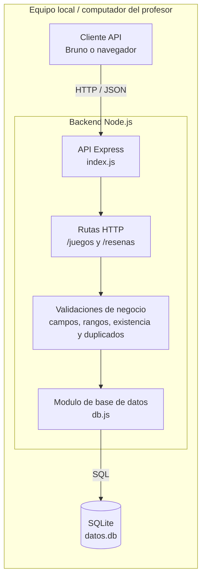

# Diagrama de Despliegue y Componentes

```mermaid id="qhxkpf"
flowchart LR
    subgraph EquipoLocal[Equipo local / computador del profesor]
        Cliente[Cliente API<br/>Bruno o navegador]

        subgraph Backend[Backend Node.js]
            API[API Express<br/>index.js]
            Rutas[Rutas HTTP<br/>/juegos y /resenas]
            Validaciones[Validaciones de negocio<br/>campos, rangos, existencia y duplicados]
            DBJS[Modulo de base de datos<br/>db.js]
        end

        SQLite[(SQLite<br/>datos.db)]
    end

    Cliente -->|HTTP / JSON| API
    API --> Rutas
    Rutas --> Validaciones
    Validaciones --> DBJS
    DBJS -->|SQL| SQLite
```
