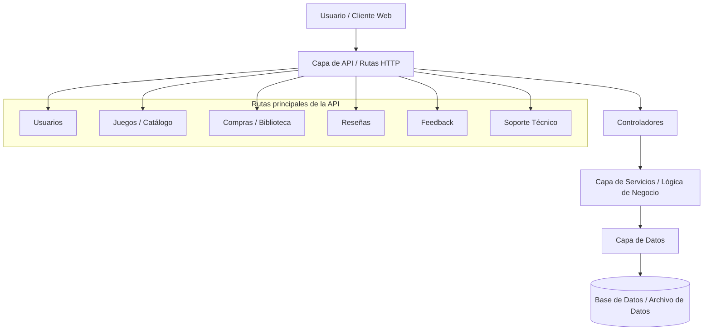

## 1. Estilo Arquitectónico 

Estilo adoptado: Arquitectura en Capas (Layered Architecture)

Justificación basada en REF priorizados: 

| ID     | Tipo                         | Descripción                                                                         | Prioridad | Cómo lo aborda el estilo                                                                           | 
|--------|------------------------------|-------------------------------------------------------------------------------------|-----------|----------------------------------------------------------------------------------------------------|
| REF-01 | Eficiencia                   | El sistema debe responder a las solicitudes en menos de 2 segundos.                 | Alta      | La separación por capas logra una mejor organización y permite respuestas más rapidas.             |
| REF-02 | Seguridad                    | Autenticación para acciones de usuario.                                             | Alta      | La arquitectura permite ubicar las validaciones en una capa antes de acceder a los datos.          |
| REF-05 | Mantenibilidad               | El codigo debe estar ordenado para facilitar su mantencion.                         | Alta      | Permite modificar una parte del sistema sin afectar directamente a las demás.                      |
| REF-07 | Integridad de datos          | El sistema debe evitar datos duplicados.                                            | Alta      | centraliza las reglas y validaciones en una capa antes de guardar información en la capa de datos. |
| REF-08 | Testabilidad                 | Las funcionalidades implementadas deben contar con casos de prueba.                 | Alta      | Es más fácil diseñar y ejecutar pruebas específicas.                                               |

**Explicación textual**:
Se escogió una arquitectura en capas porque el sistema corresponde a una plataforma de videojuegos que debe gestionar usuarios, catálogo de juegos, biblioteca personal, compras o adquisiciones, reseñas, feedback y soporte técnico.

Este estilo permite dividir el sistema en partes claras: una capa de presentación o cliente que interactúa con el usuario, una capa de API que recibe las solicitudes HTTP, una capa de lógica de negocio que valida las reglas del sistema, y una capa de datos que almacena la información principal.

La arquitectura en capas es adecuada para este proyecto porque facilita la mantención, la incorporación de nuevas funcionalidades y la realización de pruebas. Por ejemplo, si se necesita modificar la forma en que se valida una compra, solo se cambia la lógica de negocio correspondiente, sin afectar directamente la estructura de datos ni las rutas de la API.

## 2. Diagrama de Arquitectura 

## 3. Descomposición Modular 

**Capa de Presentación**

La capa de presentación corresponde a la parte del sistema con la que el usuario interactúa directamente. Su función principal es mostrar información al jugador y permitir la interacción con el sistema.

Dentro de esta capa se incluyen los siguientes módulos:

- Menú principal: Es la interfaz inicial del juego, donde el usuario puede comenzar una partida, cargar un juego previamente guardado o acceder a otras opciones.
- HUD (Head-Up Display): Corresponde a la interfaz visible durante el juego, donde se muestra información relevante como la vida del personaje, puntaje, mapa, inventario, entre otros elementos.
- Configuración: Permite al usuario modificar opciones del juego, como el sonido, los gráficos o los controles.

**Capa de Lógica del Juego**

La capa de lógica del juego es el núcleo del sistema, ya que se encarga de procesar todas las reglas, comportamientos y mecánicas del videojuego.

Los módulos que la componen son:

- Control del jugador: Gestiona las acciones del jugador, como moverse, saltar, atacar o interactuar con el entorno.
- IA de enemigos: Define el comportamiento de los enemigos dentro del juego, incluyendo sus movimientos, decisiones y reacciones frente al jugador.
- Sistema de sigilo (detección, visión): Se encarga de determinar si el jugador es detectado por los enemigos, considerando factores como la distancia, el campo de visión.

**Capa de Datos**

La capa de datos tiene como función almacenar y gestionar la información necesaria para el funcionamiento del sistema. Esta información puede ser utilizada tanto por la capa de presentación como por la capa de lógica.

Incluye los siguientes módulos:

- Configuración: Guarda las preferencias del usuario, como ajustes de audio, video y controles.
- Guardado de partidas: Permite almacenar el progreso del jugador, incluyendo niveles completados y estado del personaje.
- Datos de usuario: Contiene información del perfil del jugador, como nombre, estadísticas o historial de juego.
 
 
