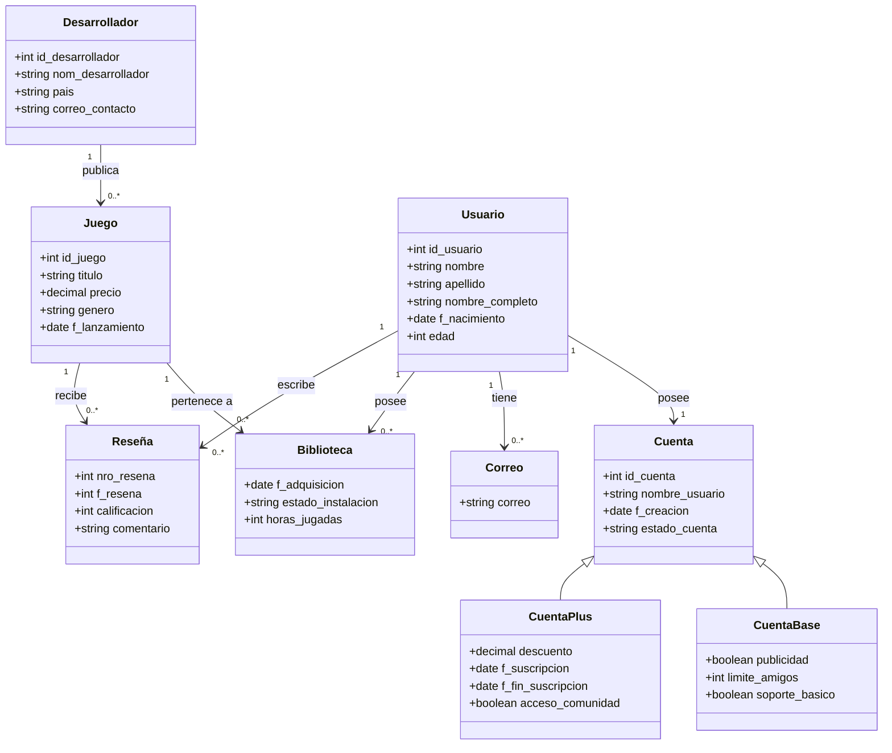

# AST-j-w

## Descripción del Sistema

El proyecto consiste en el diseño y desarrollo de una plataforma de videojuegos orientada a usuarios visitantes y registrados. La plataforma permitirá consultar un catálogo de videojuegos, buscar y filtrar títulos por distintos criterios, crear cuentas de usuario, iniciar sesión, adquirir videojuegos y gestionar una biblioteca personal.

## Historias de Usuario

| ID   | Nombre                          | Issue  | 
|------|---------------------------------|--------| 
| US-01 | Registro de usuario                | [#1](https://github.com/Ast-J-W/AST-j-w/issues/4)   | 
| US-02 | Inicio de sesión                   | [#2](https://github.com/Ast-J-W/AST-j-w/issues/5)   |
| US-03 | Visualización del catálogo         | [#3](https://github.com/Ast-J-W/AST-j-w/issues/6)   |  
| US-04 | Búsqueda y filtrado de videojuegos | [#4](https://github.com/Ast-J-W/AST-j-w/issues/7)   |  
| US-05 | Compra/adquisición de videojuegos  | [#5](https://github.com/Ast-J-W/AST-j-w/issues/8)   |  
| US-06 | Biblioteca personal                | [#6](https://github.com/Ast-J-W/AST-j-w/issues/9)   |  
| US-07 | Registro de actividad de juego     | [#7](https://github.com/Ast-J-W/AST-j-w/issues/10)  |  
| US-08 | Publicación de reseñas             | [#8](https://github.com/Ast-J-W/AST-j-w/issues/11)  |
| US-09 | Feedback sobre videojuegos         | [#9](https://github.com/Ast-J-W/AST-j-w/issues/12)  |  
| US-10 | Soporte técnico                    | [#10](https://github.com/Ast-J-W/AST-j-w/issues/13) |  

## Requisitos Extrafuncionales

Ver [ReqExtrafuncionales.md](https://github.com/Ast-J-W/AST-j-w/blob/main/ReqExtrafuncionales.md)

## Entidades del Dominio


## Diseño Arquitectónico

Ver [Arquitectura.md](https://github.com/Ast-J-W/AST-j-w/blob/main/Arquitectura.md)

# Biblioteca de Videojuegos API
API backend desarrollada con Node.js, Express y SQLite para gestionar juegos y reseñas.

## Historia de usuario implementada 
- US-08 (Publicacion de reseña)

## Tecnologías utilizadas
- Node.js
- Express
- better-sqlite3
- Bruno (Debido a una dificultad con el problema Thunder Client)

## Artefactos del proyecto

| Artefacto | Ubicación |
|---|---|
| Especificación de HU | [Link](https://github.com/Ast-J-W/AST-j-w/blob/main/EspecificacionHU.md) |
| Casos de prueba | [Link](https://github.com/Ast-J-W/AST-j-w/blob/main/CasosDePrueba.md) |
| Deuda técnica / code smells | [Link](https://github.com/Ast-J-W/AST-j-w/blob/main/DeudaTecnica.md) |
| Modelo de dominio | [Link](https://github.com/Ast-J-W/AST-j-w/blob/main/docs/Modelo_dominio.md) |
| Diagrama de casos de uso | [Link](https://github.com/Ast-J-W/AST-j-w/blob/main/docs/Diagrama-casos-uso.md) |
| Diagrama de estados | [Link](https://github.com/Ast-J-W/AST-j-w/blob/main/docs/Diagrama-estados.md) |
| Diagrama de secuencia | [Link](https://github.com/Ast-J-W/AST-j-w/blob/main/docs/Diagrama-secuencia.md) |
| Diagrama de componentes | [Link](https://github.com/Ast-J-W/AST-j-w/blob/main/docs/Diagrama-componentes.md) |
| Diagrama de despliegue y componentes | [Link](https://github.com/Ast-J-W/AST-j-w/blob/main/docs/Diagrama_despliegue) |

## Instrucciones de instalación y ejecución

### Requisitos previos

- Node.js instalado.
- npm instalado.
- Git instalado.
  
### Instalación  
1. Clonar el repositorio
   - git clone https://github.com/Ast-J-W/AST-j-w.git
2. Entrar a la carpeta del proyecto

   ```bash
   cd AST-j-w
   ```
3. Entrar al backend:

   ```bash
   cd backend
   ```
4. Instalar dependencias:

   ```bash
   npm install
   ```

### Ejecución
Para iniciar el servidor:

```bash
npm start
```
El servidor quedará disponible en: http://localhost:3000 a menos que manualmente se modifique

### Instalación y ejecución (con Docker)

Si el repositorio incluye `docker-compose.yml`, el levantamiento se realiza con:

```bash
docker-compose up --build
```

## Endpoints principales

### Juegos
| Método | Ruta        | Descripción                      | 
|--------|-------------|----------------------------------| 
| GET    | /juegos     | Lista los videojuegos existentes |
| POST   | /juegos     | Crea un videojuego               |
| PUT    | /juegos/:id | Modifica un videojuego           |
| DELETE | /juegos/:id | Elimina un videojuego            |

### Reseñas
| Método | Ruta         | Descripción                     | 
|--------|--------------|---------------------------------| 
| GET    | /resenas     | Lista las reseñas existentes    |
| POST   | /resenas     | Crea una reseña                 |
| PUT    | /resenas/:id | Modifica una reseña             |
| DELETE | /resenas/:id | Elimina una reseña              |


## Ejemplo de body para crear un juego
```json
{
  "titulo": "Elden Ring",
  "genero": "RPG",
  "precio": 39990
}
```

## Ejemplo de body para crear una reseña
```json
{
  "juego_id": 1,
  "autor": "Jesus",
  "calificacion": 5,
  "comentario": "Muy buen juego"
}
```

## Pruebas
Las pruebas de los endpoints fueron realizadas con Bruno y la colección quedó guardada junto al proyecto.

## Evidencia de GitHub workflow
| Elemento | Evidencia |
|------------|-----------|
| Rama principal | main |
| Rama de desarrollo | US-08-resenas |
| Rama de pruebas | feature/pruebas-api |
| Pull Requests | Cambios integrados mediante Pull Requests |
| Integración final | La versión evaluable se encuentra en la rama main 

## Responsabilidades del equipo 

| Integrante | Rol | Ítems de la rúbrica a cargo | 
|------------|-----|----------------------------| 
| Martín Loyola | Product Owner | 1.1 HU completa, 1.2 Instalacion y ejecucion, 1.3 GitHub workflow, 2.1 Modelo de dominio, 2.2 Diagrama de caso de uso, 2.3 Especificacion de HU | 
| Jesús Carvajal | Scrum Master  | 2.4 Diagrama de estados, 3.1 Despliegue y componentes, 3.2 Diagrama de componentes, 3.3 Diagrama de secuencia, 4.1 Casos de prueba, 5.1 Deuda tecnica / Code smells |

