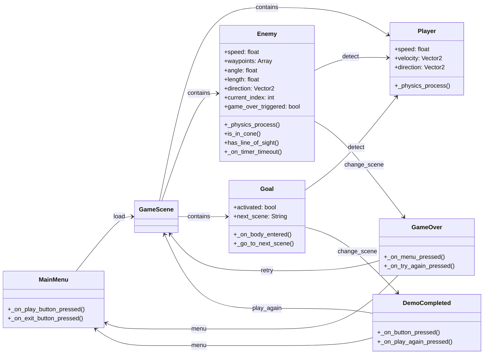

# AST-j-w

## Descripción del Sistema

El proyecto consiste en el diseño y desarrollo de una plataforma de videojuegos orientada al usuario, que combina un ecosistema de juegos personalizados con una arquitectura que integra recepción de feedback y soporte técnico, permitiendo que la evolución del catálogo sea impulsada directamente por la comunidad.

## Historias de Usuario

| ID   | Nombre                          | Issue  | 
|------|---------------------------------|--------| 
| US-01 | Registro de usuario                | [#1](https://github.com/Ast-J-W/AST-j-w/issues/4)   | 
| US-02 | Inicio de sesión                   | [#2](https://github.com/Ast-J-W/AST-j-w/issues/5)   |
| US-03 | Visualización del catálogo         | [#3](https://github.com/Ast-J-W/AST-j-w/issues/6)   |  
| US-04 | Búsqueda y filtrado de videojuegos | [#4](https://github.com/Ast-J-W/AST-j-w/issues/7)   |  
| US-05 | Compra/adquisición de videojuegos  | [#5](https://github.com/Ast-J-W/AST-j-w/issues/8)   |  
| US-06 | Biblioteca personal                | [#6](https://github.com/Ast-J-W/AST-j-w/issues/9)   |  
| US-07 | Registro de actividad de juego     | [#7](https://github.com/Ast-J-W/AST-j-w/issues/10)  |  
| US-08 | Publicación de reseñas             | [#8](https://github.com/Ast-J-W/AST-j-w/issues/11)  |
| US-09 | Feedback sobre videojuegos         | [#9](https://github.com/Ast-J-W/AST-j-w/issues/12)  |  
| US-10 | Soporte técnico                    | [#10](https://github.com/Ast-J-W/AST-j-w/issues/13) |  

## Requisitos Extrafuncionales

Ver [ReqExtrafuncionales.md](https://github.com/AST-Code-Play/Proyecto-Fundamentos-De-Software/blob/main/ReqExtrafuncionales.md)

## Entidades del Dominio

## Mockups

| Mockup | Historia de usuario relacionada | 
|--------|----------------------------------| 
| [Prototipo en Figma](https://www.figma.com/design/bwICFC1WD77lRQX0Z2WnyY/Splinter-Gear-Liquid-X?node-id=0-1&p=f&t=U9F0MKpkNRh91lEm-0) | US-01 al US-10 |

Ver [Archivo ZIP del juego](https://drive.google.com/file/d/1vOnuNOZdk9rHsPeoO6IZqY0eES7on1QN/view)

## Diseño Arquitectónico

Ver [Arquitectura.md](https://github.com/AST-Code-Play/Proyecto-Fundamentos-De-Software/blob/main/Arquitectura.md)

## Responsabilidades del equipo 

| Integrante | Rol | Ítems de la rúbrica a cargo | 
|------------|-----|----------------------------| 
| Martín Loyola | Product Owner | 1.1 Mejora dehistoria de usuarios con clarita review | 
| Jesús Carvajal | Scrum Master  | 2.1 Desarrollo de un HU en backend (APIs) |
