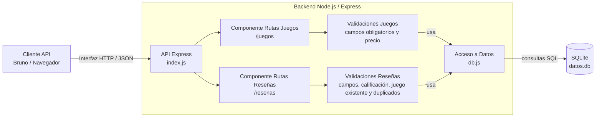

# Diagrama de Componentes

```mermaid
flowchart LR
    C[Cliente API<br/>Bruno / Navegador]

    subgraph B[Backend Node.js / Express]
        API[API Express<br/>index.js]
        RJ[Componente Rutas Juegos<br/>/juegos]
        RR[Componente Rutas Reseñas<br/>/resenas]
        VJ[Validaciones Juegos<br/>campos obligatorios y precio]
        VR[Validaciones Reseñas<br/>campos, calificación, juego existente y duplicados]
        DBJS[Acceso a Datos<br/>db.js]
    end

    D[(SQLite<br/>datos.db)]

    C -->|Interfaz HTTP / JSON| API
    API --> RJ
    API --> RR
    RJ --> VJ
    RR --> VR
    VJ -->|usa| DBJS
    VR -->|usa| DBJS
    DBJS -->|consultas SQL| D
```
