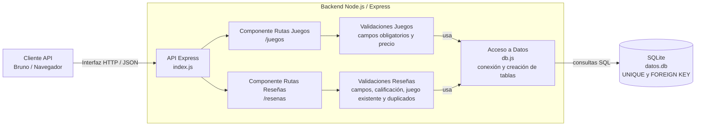

# Diagrama de Componentes con dependencias e interfaces
El backend se compone de una API Express que expone endpoints para la gestión de juegos y reseñas. Estos componentes dependen de validaciones de negocio y del acceso a datos centralizado, el cual utiliza SQLite para persistir la información del sistema.

### Interfaces expuestas

- Interfaz HTTP REST de Juegos:
  - `GET /juegos`
  - `POST /juegos`
  - `PUT /juegos/:id`
  - `DELETE /juegos/:id`

- Interfaz HTTP REST de Reseñas:
  - `GET /resenas`
  - `POST /resenas`
  - `PUT /resenas/:id`
  - `DELETE /resenas/:id`

### Dependencias entre componentes

- El cliente depende de la API Express para enviar solicitudes HTTP y recibir respuestas en formato JSON.
- La API Express depende de los componentes de Juegos y Reseñas para procesar las operaciones disponibles.
- El componente de Juegos depende de sus validaciones para verificar campos obligatorios y precio válido.
- El componente de Reseñas depende de sus validaciones para verificar campos obligatorios, rango de calificación, existencia del juego asociado y ausencia de duplicados.
- Ambos componentes dependen de `db.js` para acceder a los datos persistidos.
- `db.js` depende de SQLite y del archivo `datos.db`, donde se almacenan las tablas del sistema.

El diagrama muestra los principales componentes del backend y las relaciones de dependencia entre ellos. El cliente consume la API Express mediante una interfaz HTTP/JSON, y esta API organiza la funcionalidad en los componentes de juegos y reseñas, cada uno con sus respectivas validaciones de negocio.

El componente de juegos valida campos obligatorios y precio, mientras que el componente de reseñas valida campos obligatorios, rango de calificación, existencia del juego asociado y ausencia de duplicados antes de persistir la información.

Ambos componentes dependen de db.js para el acceso a datos, y este componente centraliza la conexión con la base SQLite datos.db, donde se almacenan las tablas juegos y resenas, incluyendo restricciones como UNIQUE y FOREIGN KEY.

De esta forma, el diagrama representa explícitamente las interfaces externas del sistema y las dependencias internas entre API, validaciones, acceso a datos y persistencia, en coherencia con la implementación actual del proyecto.
