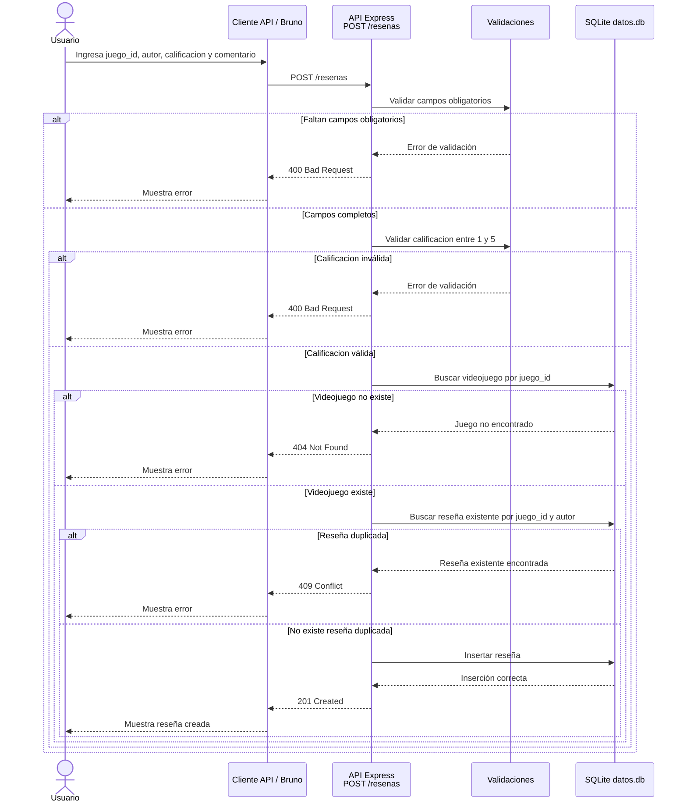

# Diagrama de Secuencia - US-08 Publicación de Reseñas

```mermaid id="y3n3fj"
sequenceDiagram
    actor Usuario
    participant Cliente as Cliente API / Bruno
    participant API as API Express<br/>POST /resenas
    participant Validacion as Validaciones
    participant DB as SQLite datos.db

    Usuario->>Cliente: Ingresa juego_id, autor, calificacion y comentario
    Cliente->>API: POST /resenas

    API->>Validacion: Validar campos obligatorios

    alt Faltan campos obligatorios
        Validacion-->>API: Error de validación
        API-->>Cliente: 400 Bad Request
        Cliente-->>Usuario: Muestra error
    else Campos completos
        API->>Validacion: Validar calificacion entre 1 y 5

        alt Calificacion inválida
            Validacion-->>API: Error de validación
            API-->>Cliente: 400 Bad Request
            Cliente-->>Usuario: Muestra error
        else Calificacion válida
            API->>DB: Buscar videojuego por juego_id

            alt Videojuego no existe
                DB-->>API: Juego no encontrado
                API-->>Cliente: 404 Not Found
                Cliente-->>Usuario: Muestra error
            else Videojuego existe
                API->>DB: Buscar reseña existente por juego_id y autor

                alt Reseña duplicada
                    DB-->>API: Reseña existente encontrada
                    API-->>Cliente: 409 Conflict
                    Cliente-->>Usuario: Muestra error
                else No existe reseña duplicada
                    API->>DB: Insertar reseña
                    DB-->>API: Inserción correcta
                    API-->>Cliente: 201 Created
                    Cliente-->>Usuario: Muestra reseña creada
                end
            end
        end
    end
```
